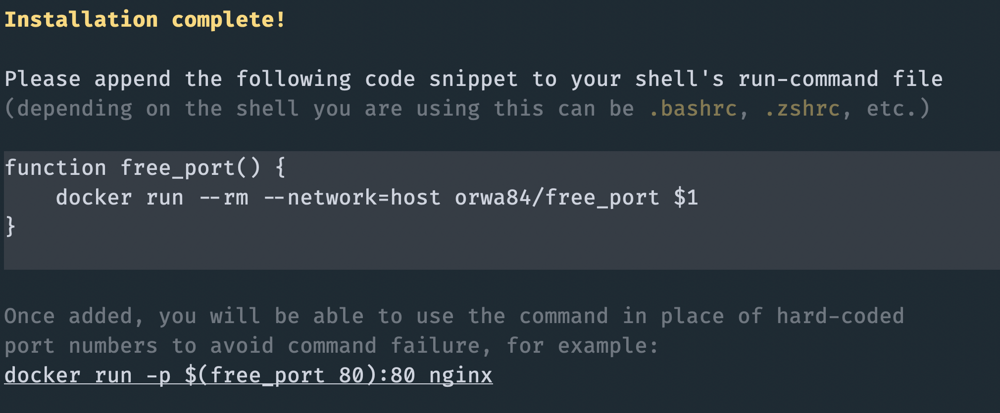

# free_port

Refer to the docker image, which is published on Docker hub at [orwa84/free_port](https://hub.docker.com/r/orwa84/free_port).

## Installation

Install by running the `install.sh` file, and proceed to add the provided lines to your shell's `rc` file (e.g. `.bashrc`, `.zshrc`, etc.).

Below is a screenshot of what a successful installation looks like:

